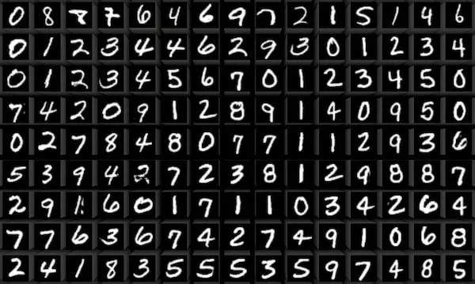
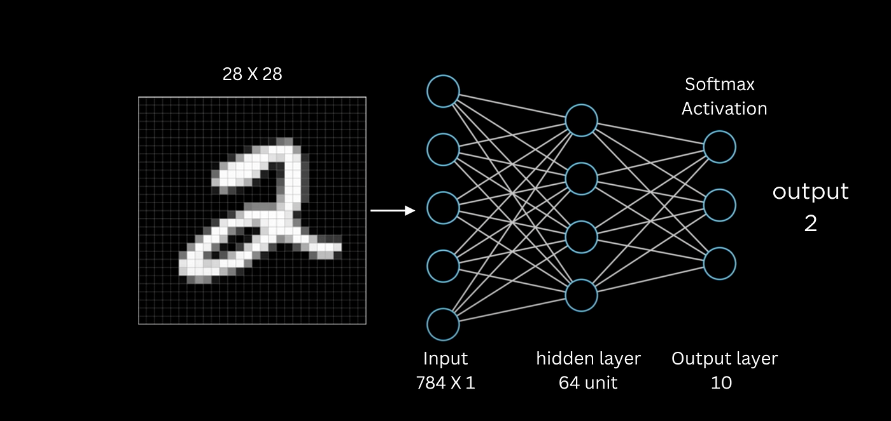

# mnist_mlp



## Description

Le MLP (Multilayer Perceptron) est constitué de trois couches principales :
- La couche d'entrée (Input layer)
- La couche cachée (Hidden layer)
- La couche de sortie (Output layer)



## Training results
Le jeu d'apprentissage est constitué de **60 000** exemples et le jeu de test de **10 000** exemples.

| Epochs | Durée (s) | Précision (%) |
|--------|-----------|---------------|
| 10     | 2.84      | 67.07         |
| 20     | 5.46      | 79.50         |
| 100    | 28.07     | 88.88         |
| 200    | 54.85     | 90.58         |
| 500    | 140.08    | 92.59         |
| 1000   | 282.57    | 93.59         |
| 2000   | 556.29    | 95.24         |
| 5000   | 1389.06   | 97.05         |

## Input layer
Elle sert à faire entrer dans le MLP chaque pixel de l'image. Dans le cas de MNIST, chaque image est composée de 28x28 pixels, soit 784 pixels au total.

## Hidden layer
Dans cette couche, on réalise le produit scalaire des pixels d'entrée avec les poids associés à cette couche. Puis, on applique une fonction d'activation **ReLU** (Rectified Linear Unit) pour introduire de la non-linéarité. 
La fonction ReLU produit des valeurs dans l'intervalle [0, ∞].

## Output layer
Dans la couche de sortie, on réalise à nouveau un produit scalaire des valeurs issues de la couche cachée et des poids de cette couche. Ensuite, on applique **Softmax** pour obtenir une probabilité pour chaque classe. Cette probabilité est calculée de manière dépendante, c’est-à-dire que la somme des probabilités est égale à 1.

Exemple de sortie :
```python
[0.65, 0.15, 0.10, ...]
```
Cela signifie que :
- La probabilité d'appartenir à la classe 0 est de **65%**,
- La probabilité d'appartenir à la classe 1 est de **15%**,
- La probabilité d'appartenir à la classe 2 est de **10%**.

## Loss

La fonction **cross_entropy_loss** est utilisée pour mesurer la **distance** entre la réponse prédite (yp) et la vérité (y). La cross-entropy calcule l'écart entre la distribution des probabilités prédites par le modèle et la distribution des probabilités de la vérité terrain (qui est un vecteur one-hot).

L’objectif de l’apprentissage du MLP est de **minimiser cette distance** pour améliorer les prédictions à chaque itération.

### Calcul du loss
Le calcul du **loss** est effectué avec la formule suivante :

*loss = y_true * log(y_pred)*

#### Pourquoi utiliser le logarithme ?
Le logarithme sert à **fortement pénaliser les mauvaises prédictions**. En effet, plus la prédiction est éloignée de la vérité, plus la perte sera grande.

Les valeurs de *y_pred* sont toujours comprises entre **0** et **1** (grâce à **Softmax**). Quelques exemples de calculs de logarithme :

- *log(0.9) = -0.1*
- *log(0.1) = -2.3*
- *log(0.0001) = -9.2*

#### Attention !
- *log(0)* mène à une erreur (indéfini).
- *log(1) = 0* : Cela indique qu’il n’y a **aucune erreur** lorsqu’une prédiction est parfaitement correcte.

Si le gradient devient 0, cela indique que l'apprentissage ne progresse pas. Pour éviter ce problème, nous utilisons une petite valeur proche de zéro : on transforme *y_pred = 0* en *1e^{-15}* et *y_pred = 1* en *1 - 1e^{-15}*.

### Exemple de calcul du loss
Supposons : 
- *y_true = [0, 1, 0]*
- *y_pred = [0.25, 0.5, 0.25]*

Le calcul du loss se fait comme suit :
- *loss = [0 x log(0.25), 1 x log(0.5), 0 x log(0.25)]*
- *loss = [0, 1 x log(0.5), 0]*

Dans cet exemple, le gradient/loss associé est le suivant.